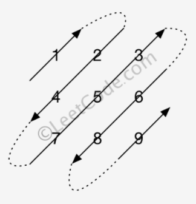

* content
{:toc}

## 498 对角线遍历

- 给定一个含有$M*N$个元素的矩阵（M行，N列），请以对角线遍历的顺序返回这个矩阵中的所有元素，对角线遍历如下图所示。

<div align="center">  </div>

- 【思路】对角线上的元素和为k，只要考虑y的范围即可，y的范围可以通过以下不等式组解出
  
$$
\left\{
\begin{aligned}
i + j & = k \\
0\leq i&\leq M-1 \Rightarrow y\in [max(1-m+k,0),min(k,n-1)]（整数）\\
0\leq j&\leq N-1  \\
\end{aligned}
\right.
$$

```python
class Solution:
    def findDiagonalOrder(self, matrix: List[List[int]]) -> List[int]:
        res = []
        if len(matrix) == 0:
            return res
        m, n = len(matrix), len(matrix[0])
        for k in range(m+n-1):
            if k%2 == 0:
                for j in range(max(1-m+k,0), min(k,n-1)+1, 1):
                    res.append(matrix[k-j][j])
            else:
                for j in range(min(k,n-1), max(1-m+k,0)-1, -1):
                    res.append(matrix[k-j][j])
        return res
```